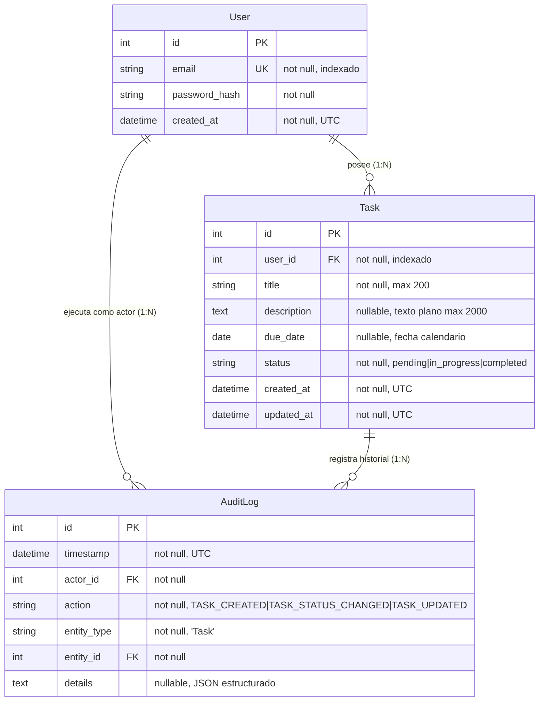
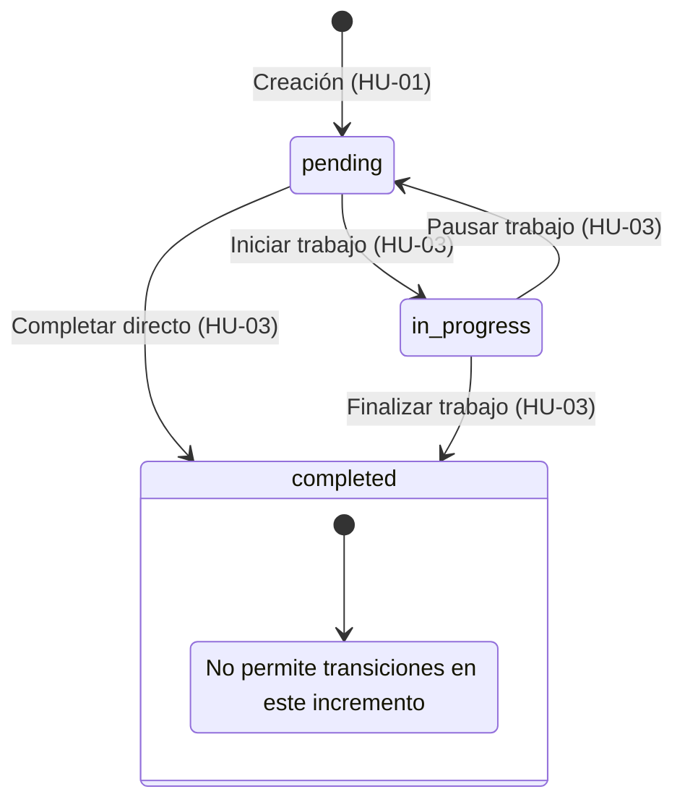

# Data Model: Primer Incremento TaskControl

**Feature**: `001-core-task-auth`  
**Date**: 2026-10-06  
**ORM**: SQLAlchemy (Flask-SQLAlchemy)  

---

## 1. Diagrama Entidad-Relación

---

## 2. Definición Detallada de Entidades

### 2.1 Entidad `User` (Tabla: `users`)
Representa a una persona registrada en la plataforma con credenciales y titularidad sobre sus tareas.

| Campo | Tipo | Restricciones | Descripción |
|---|---|---|---|
| `id` | `Integer` | Primary Key, Autoincrement | Identificador numérico único del usuario. |
| `email` | `String(255)` | Unique, Not Null, Index | Correo electrónico normalizado (lowercase, trim). |
| `password_hash` | `String(255)` | Not Null | Hash criptográfico generado mediante algoritmo `scrypt`. |
| `created_at` | `DateTime(timezone=True)` | Not Null, Default=UTC | Marca temporal del registro del usuario. |

**Reglas de Validación (Capa de Dominio)**:
- El correo electrónico debe coincidir con la expresión regular estándar de formato de correo.
- No puede existir duplicidad de correos independientemente de mayúsculas/minúsculas.
- La contraseña en texto plano recibida en el registro debe tener mínimo 8 caracteres y contener al menos una letra y al menos un número antes de ser hasheada.

---

### 2.2 Entidad `Task` (Tabla: `tasks`)
Representa una tarea o compromiso bajo el control exclusivo de su usuario propietario.

| Campo | Tipo | Restricciones | Descripción |
|---|---|---|---|
| `id` | `Integer` | Primary Key, Autoincrement | Identificador numérico único de la tarea. |
| `user_id` | `Integer` | Foreign Key (`users.id`), Not Null, Index | Propietario de la tarea. Clave foránea con cascada de eliminación. |
| `title` | `String(200)` | Not Null | Título de la tarea (obligatorio, no vacío, longitud entre 1 y 200 caracteres). |
| `description` | `Text` | Nullable | Detalle en texto plano (hasta 2000 caracteres). Se escapan caracteres especiales HTML. |
| `due_date` | `Date` | Nullable | Fecha límite de calendario (formato YYYY-MM-DD). Se admiten fechas pasadas, presentes o futuras. |
| `status` | `String(20)` | Not Null, Default='pending' | Estado del ciclo de vida: `'pending'`, `'in_progress'`, o `'completed'`. |
| `created_at` | `DateTime(timezone=True)` | Not Null, Default=UTC | Fecha y hora de creación de la tarea. |
| `updated_at` | `DateTime(timezone=True)` | Not Null, Default=UTC, OnUpdate=UTC | Fecha y hora de la última modificación. |

**Reglas de Validación (Capa de Dominio)**:
- El título no puede ser una cadena vacía ni estar compuesto solo por espacios en blanco.
- La descripción es tratada estrictamente como texto plano; no se interpreta formato Markdown ni HTML.
- La fecha límite debe ser una fecha de calendario válida si se proporciona.
- Un usuario solo puede acceder o modificar tareas donde `task.user_id == current_user_id`.

---

### 2.3 Entidad `AuditLog` (Tabla: `audit_logs`)
Registro inmutable de auditoría para cada mutación sobre las tareas del sistema (Principio VIII).

| Campo | Tipo | Restricciones | Descripción |
|---|---|---|---|
| `id` | `Integer` | Primary Key, Autoincrement | Identificador único del evento de auditoría. |
| `timestamp` | `DateTime(timezone=True)` | Not Null, Default=UTC | Marca temporal precisa en UTC en que ocurrió el evento. |
| `actor_id` | `Integer` | Foreign Key (`users.id`), Not Null | Usuario que desencadenó la acción. |
| `action` | `String(50)` | Not Null | Código de acción (`TASK_CREATED`, `TASK_STATUS_CHANGED`, `TASK_UPDATED`). |
| `entity_type` | `String(50)` | Not Null, Default='Task' | Tipo de entidad afectada. |
| `entity_id` | `Integer` | Foreign Key (`tasks.id`), Not Null | Identificador de la tarea afectada. |
| `details` | `Text` | Nullable | Cadena JSON con metadatos del cambio (e.g., estados previo y nuevo, o campos modificados). |

---

## 3. Máquina de Estados de Tareas (`TaskStatus`)

### Matriz de Transiciones Permitidas

| Estado Actual | Transición Solicitada | Permitida | Acción de Auditoría | Justificación / Criterio |
|---|---|---|---|---|
| `pending` | `in_progress` | **SÍ** | `TASK_STATUS_CHANGED` | Inicio de actividad normal. |
| `pending` | `completed` | **SÍ** | `TASK_STATUS_CHANGED` | Cierre directo de tarea simple. |
| `in_progress` | `pending` | **SÍ** | `TASK_STATUS_CHANGED` | Pausa o devolución a cola de espera. |
| `in_progress` | `completed` | **SÍ** | `TASK_STATUS_CHANGED` | Culminación de trabajo en curso. |
| `completed` | `pending` | **NO (400)** | Ninguna | Bloqueado: requiere reapertura formal (HU-06, incremento posterior). |
| `completed` | `in_progress` | **NO (400)** | Ninguna | Bloqueado: requiere reapertura formal (HU-06, incremento posterior). |
| Cualquier estado | Mismo estado | **NO (400)** | Ninguna | Transición no operativa (sin cambio). |
